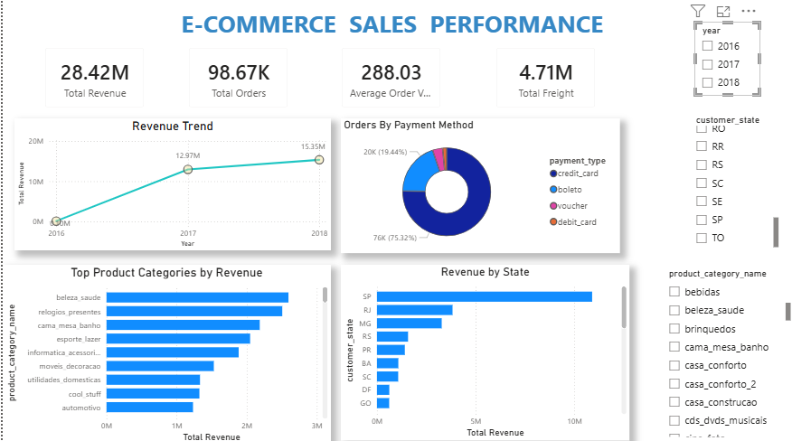
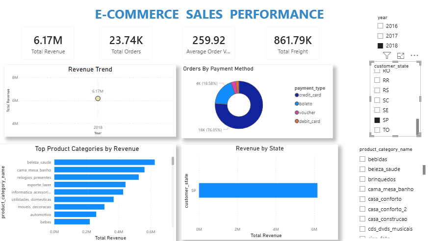

# InsightForge — E-Commerce Analytics Platform

> An end-to-end e-commerce analytics platform that transforms raw transactional data into actionable business insights using Python, PostgreSQL, Advanced SQL, and Power BI.

## 📊 Dashboard Preview

### Executive Overview


### Interactive Business Analysis


---

## 🚀 Interactive Power BI Dashboard

The screenshots above provide a quick preview of the analytics platform.

The complete Power BI report is available as a `.pbix` file in the `dashboards/` directory for users who want to explore the interactive slicers, filters, drill-through pages, and other Power BI features using Power BI Desktop.

---

## 🔍 Key Business Insights

*Business insights are derived directly from the PostgreSQL data warehouse and will be documented here after validation through analytical SQL queries.*
---

---

## Business Problem

E-commerce businesses generate large amounts of transactional data, but raw data alone does not provide clear answers to important business questions.

InsightForge was built to answer questions such as:

- How is revenue changing over time?
- Which product categories generate the most sales?
- Which states and regions contribute the most revenue?
- Which payment methods are most commonly used?
- How many orders and customers does the business have?
- Which sellers and products contribute most to performance?
- How does delivery performance affect customer experience?

---

## Project Objective

The objective of InsightForge is to build a complete analytics workflow:

```text
Raw CSV Data
     ↓
Data Profiling
     ↓
Python ETL
     ↓
PostgreSQL Raw Schema
     ↓
Analytical Warehouse
     ↓
SQL Analysis
     ↓
Power BI Dashboard
     ↓
Business Insights